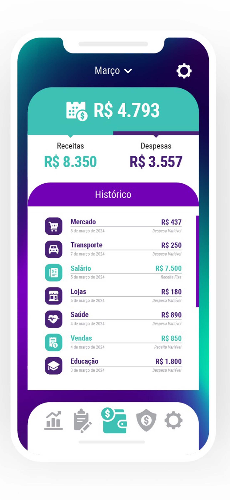

# Easy - Controle Financeiro Pessoal 📱💰

[](https://reactnative.dev/)
[](https://expo.dev/)
[](https://www.typescriptlang.org/)
[](https://firebase.google.com/)
[](LICENSE)

> Um aplicativo completo de controle financeiro pessoal com sistema de compartilhamento, desenvolvido em React Native com Firebase.

## 🚀 Funcionalidades

### 💰 Gestão Financeira
- **Receitas e Despesas**: Controle completo de entradas e saídas
- **Categorização**: Organize por categorias personalizadas
- **Filtros Avançados**: Por mês, categoria, valores mín/máx
- **Relatórios**: Visualização em gráficos e resumos
- **Assinaturas**: Controle de gastos recorrentes

### 👥 Sistema de Compartilhamento
- **Convites**: Envie convites para outros usuários
- **Aceitar/Rejeitar**: Controle de permissões
- **Favoritos**: Usuários favoritos para compartilhamento rápido
- **Sincronização Real-time**: Atualizações em tempo real
- **Notificações Push**: Alertas para novos compartilhamentos

### 🛒 Lista de Compras
- **Marketplace**: Crie e gerencie listas de compras
- **Itens Compartilháveis**: Colabore com outros usuários
- **Categorização**: Organize por categorias
- **Medições**: Diferentes unidades de medida
- **Observações**: Adicione detalhes aos itens

### ✅ Tarefas e Lembretes
- **Sistema de Tarefas**: Crie e gerencie tarefas
- **Status**: Pendente, em andamento, concluída
- **Compartilhamento**: Tarefas colaborativas
- **Notificações**: Lembretes personalizados

### 📝 Notas
- **Anotações**: Sistema completo de notas
- **Compartilhamento**: Notas colaborativas
- **Formatação**: Suporte a texto rico
- **Organização**: Por categorias e tags

### 📅 Calendário
- **Eventos**: Agende eventos importantes
- **Lembretes**: Notificações personalizadas
- **Compartilhamento**: Eventos colaborativos
- **Integração**: Sincronização com agenda

### 🔔 Notificações
- **Push Notifications**: Via OneSignal
- **Lembretes**: Personalizáveis por evento
- **Alertas**: Para vencimentos e compromissos
- **Configuração**: Controle granular de notificações

## 🛠️ Tecnologias

### Frontend
- **React Native 0.79.2**: Framework mobile
- **Expo 53.0.9**: Plataforma de desenvolvimento
- **TypeScript 5.8.3**: Tipagem estática
- **Styled Components**: Estilização CSS-in-JS
- **React Navigation**: Navegação entre telas
- **React Hook Form**: Gerenciamento de formulários
- **Zod**: Validação de schemas

### Backend & Serviços
- **Firebase Auth**: Autenticação de usuários
- **Firestore**: Banco de dados NoSQL
- **Firebase Storage**: Armazenamento de arquivos
- **OneSignal**: Notificações push
- **Google Mobile Ads**: Monetização

### Ferramentas de Desenvolvimento
- **ESLint**: Linting de código
- **Prettier**: Formatação de código
- **Jest**: Framework de testes
- **React Native Testing Library**: Testes de componentes

## 📱 Screenshots

<div style="display: flex; gap: 10px; flex-wrap: wrap;">
  
  
  
  
</div>

## 🚀 Instalação

### Pré-requisitos
- Node.js 18+ 
- npm ou yarn
- Expo CLI
- Android Studio (para Android)
- Xcode (para iOS - macOS apenas)

### 1. Clone o repositório
```bash
git clone https://github.com/seu-usuario/easy.git
cd easy
```

### 2. Instale as dependências
```bash
npm install
# ou
yarn install
```

### 3. Configure o Firebase
1. Crie um projeto no [Firebase Console](https://console.firebase.google.com/)
2. Adicione um app Android/iOS
3. Baixe os arquivos de configuração:
   - `google-services.json` (Android)
   - `GoogleService-Info.plist` (iOS)
4. Coloque os arquivos na raiz do projeto

### 4. Configure as variáveis de ambiente
Crie um arquivo `.env` na raiz:
```env
FIREBASE_API_KEY=sua_api_key
FIREBASE_AUTH_DOMAIN=seu_projeto.firebaseapp.com
FIREBASE_PROJECT_ID=seu_projeto_id
FIREBASE_STORAGE_BUCKET=seu_projeto.appspot.com
FIREBASE_MESSAGING_SENDER_ID=seu_sender_id
FIREBASE_APP_ID=seu_app_id
ONESIGNAL_APP_ID=seu_onesignal_app_id
ONESIGNAL_REST_API_KEY=sua_onesignal_api_key
```

### 5. Execute o projeto
```bash
# Desenvolvimento
npm start
# ou
expo start

# Android
npm run android

# iOS
npm run ios

# Web
npm run web
```

## 🧪 Testes

### Executar todos os testes
```bash
npm test
```

### Executar testes em modo watch
```bash
npm run test:watch
```

### Executar testes com coverage
```bash
npm run test:coverage
```

### Executar testes específicos
```bash
npm test -- --testNamePattern="ShareWithUsers"
```

## 📦 Build e Deploy

### Build para desenvolvimento
```bash
npm run build:dev
```

### Build para preview
```bash
npm run build:preview
```

### Build para produção
```bash
npm run build:prod
```

### Deploy automático
```bash
npm run submit
```

## 🏗️ Arquitetura

```
src/
├── components/          # Componentes reutilizáveis
│   ├── Button/         # Botões customizados
│   ├── Input/          # Campos de entrada
│   ├── ShareWithUsers/ # Sistema de compartilhamento
│   └── ...
├── screens/            # Telas da aplicação
│   ├── Home/          # Dashboard principal
│   ├── Shared/        # Tela de compartilhamentos
│   ├── Market/        # Lista de compras
│   └── ...
├── contexts/          # Contextos React
│   ├── MarketContext.tsx
│   ├── TaskContext.tsx
│   └── ...
├── hooks/             # Hooks customizados
│   ├── useUserAuth.ts
│   ├── useMarket.ts
│   └── ...
├── services/          # Serviços externos
│   ├── firebase/      # Serviços Firebase
│   └── one-signal.ts  # Notificações
├── utils/             # Utilitários
├── theme/             # Tema e estilos
└── @types/            # Definições TypeScript
```

## 🔧 Configuração

### Firebase
O projeto usa Firebase para:
- **Authentication**: Login/registro de usuários
- **Firestore**: Armazenamento de dados
- **Storage**: Upload de imagens de perfil
- **Analytics**: Métricas de uso

### OneSignal
Configurado para:
- **Push Notifications**: Notificações push
- **In-App Messages**: Mensagens dentro do app
- **Email Notifications**: Notificações por email

### Google Mobile Ads
Implementado para:
- **Banner Ads**: Anúncios em banner
- **Interstitial Ads**: Anúncios intersticiais
- **Rewarded Ads**: Anúncios com recompensa

## 📊 Métricas e Analytics

O app coleta métricas importantes:
- **Engajamento**: Tempo de uso, sessões
- **Funcionalidades**: Uso de cada feature
- **Erros**: Crash reports e erros
- **Performance**: Tempo de carregamento

## 🔒 Segurança

- **Autenticação**: Firebase Auth com email/senha
- **Autorização**: Controle de acesso por usuário
- **Validação**: Zod schemas para validação
- **Sanitização**: Limpeza de dados de entrada
- **Rate Limiting**: Proteção contra spam

## 🤝 Contribuição

1. Fork o projeto
2. Crie uma branch para sua feature (`git checkout -b feature/AmazingFeature`)
3. Commit suas mudanças (`git commit -m 'Add some AmazingFeature'`)
4. Push para a branch (`git push origin feature/AmazingFeature`)
5. Abra um Pull Request

### Padrões de Código
- Use TypeScript para tipagem
- Siga o ESLint configurado
- Escreva testes para novas funcionalidades
- Documente funções complexas
- Use commits semânticos

## 📝 Changelog

### [1.0.0] - 2024-01-XX
- ✨ Lançamento inicial
- 💰 Sistema de controle financeiro
- 👥 Sistema de compartilhamento
- 🛒 Lista de compras
- ✅ Sistema de tarefas
- 📝 Sistema de notas
- 📅 Calendário de eventos
- 🔔 Notificações push

## 📄 Licença

Este projeto está licenciado sob a Licença MIT - veja o arquivo [LICENSE](LICENSE) para detalhes.

## 👨‍💻 Autor

**Vitor Abreu**
- GitHub: [@seu-usuario](https://github.com/seu-usuario)
- LinkedIn: [Vitor Abreu](https://linkedin.com/in/vitor-abreu)

## 🙏 Agradecimentos

- [Expo](https://expo.dev/) pela plataforma incrível
- [Firebase](https://firebase.google.com/) pelos serviços robustos
- [React Native](https://reactnative.dev/) pela framework
- [OneSignal](https://onesignal.com/) pelas notificações

## 📞 Suporte

- 📧 Email: suporte@easyapp.com
- 💬 Discord: [Easy Community](https://discord.gg/easy)
- 📱 App Store: [Easy - Controle Financeiro](link-app-store)
- 🎯 Google Play: [Easy - Controle Financeiro](link-google-play)

---

⭐ Se este projeto te ajudou, considere dar uma estrela no repositório! 